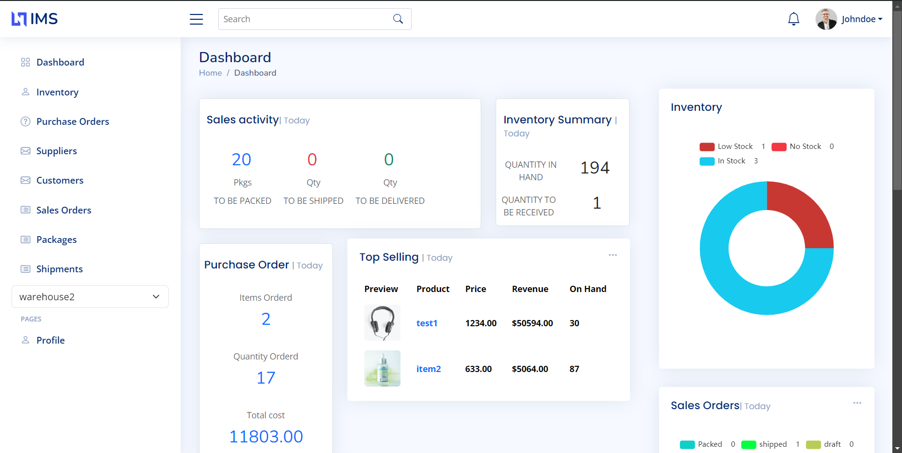

## About the Project
IMS is an Inventory Management System which provides low-level stock control and part tracking. The core of the IMS system is a Python/Django database backend which provides an web interface and a REST API for interaction with warehouse interfaces and applications.

<figure>
<h2>Dashboard</h2>

</figure>
<figure>
<h2>Inventory</h2>

</figure>
<h2>Purchase Order</figcaption>

</figure>
<h2>Notifications</figcaption>

</figure>
